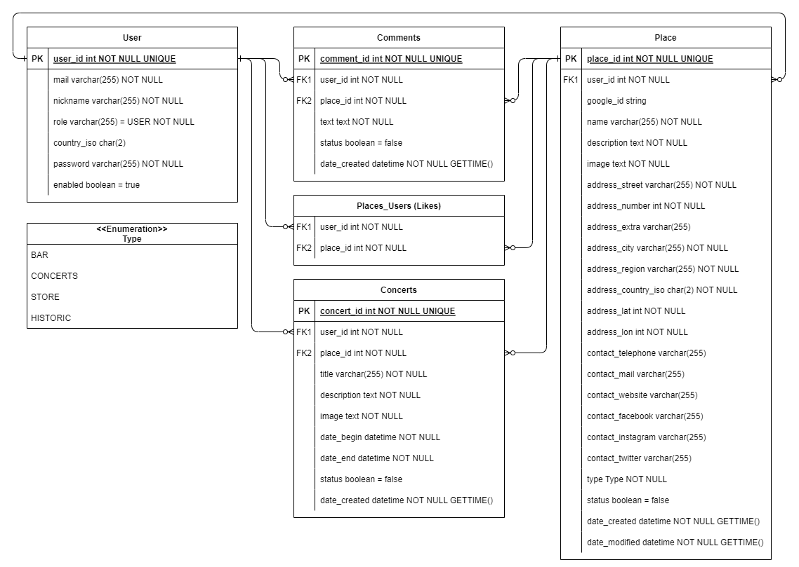

# Metal Travel Guide
A Worldwide travel guide for *metalheads* made with [Java Spring](https://spring.io/) and [Angular](https://angular.io/) as part of my Java Spring course at [digitalcity.brussels](https://digitalcity.brussels/)

  
  

## WORK IN PROGRESS

Check the frontend here: [MTG Website](https://luisromeroaraya.github.io/metaltravelguide/)

You can test the Backend API commands here: [Swagger-UI](https://metaltravelguide.herokuapp.com/swagger-ui/index.html)

UML use case diagram:

Entity relationship diagram:

### Other tools used in the project:
- [IntelliJ IDEA](https://www.jetbrains.com/idea/)
- [JPA Buddy](https://www.jpa-buddy.com/)
- [Lombok](https://projectlombok.org/)
- [SwaggerUI](https://swagger.io/tools/swagger-ui/)
- [Bootstrap 5.2](https://getbootstrap.com/)
- [Bootstrap Icons](https://icons.getbootstrap.com/)
- [Flag Icons](https://www.npmjs.com/package/flag-icons)
- [Google Maps API](https://developers.google.com/maps/documentation/javascript/overview)
- [Google Maps type definitions](https://www.npmjs.com/package/@types/google.maps)
- [Toasters by ngx-toastr](https://www.npmjs.com/package/ngx-toastr)
- [Metal Vengeance font, by Darrell Flood](https://www.dafont.com/metal-vengeance.font)
- [DateAsAgo pipe](https://techincent.com/angular-date-as-ago-minutes-hours-days-months-years-ago-pipe/)
- [JWT-decode](https://www.npmjs.com/package/jwt-decode)
- [Java-JWT](https://github.com/auth0/java-jwt)
- [PostgreSQL](https://www.postgresql.org/)
- [Heroku](https://www.heroku.com)

### Greetings
- Inspired by the website ["Headbanger's Travel Guide"](https://headbangerstravelguide.com/) and the original ["The Metal Travel Guide"](https://web.archive.org/web/20040626111046/http://www.metaltravelguide.com/) created in the early 2000's.
- Thanks to [David Vivanco](https://github.com/3djdavid2) for uploading [this Google Maps API tutorial](https://www.youtube.com/watch?v=CB1afRE9hdE)
